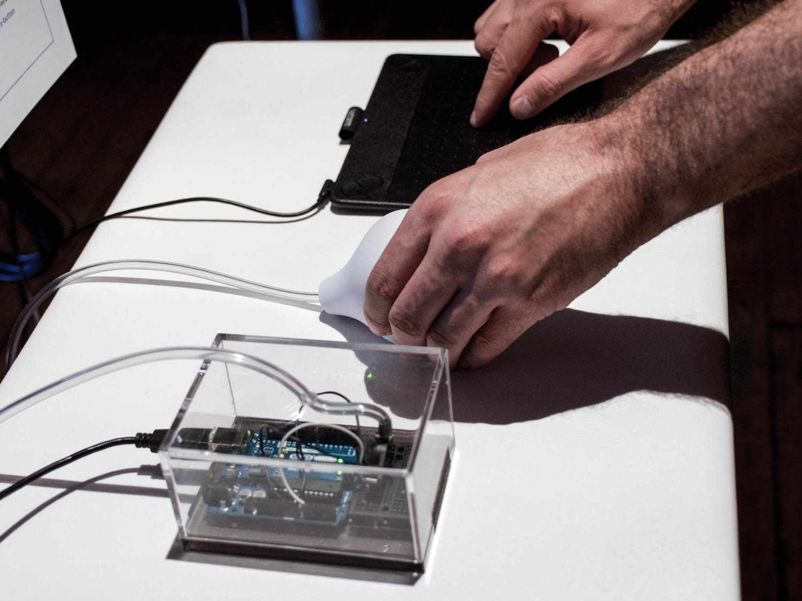
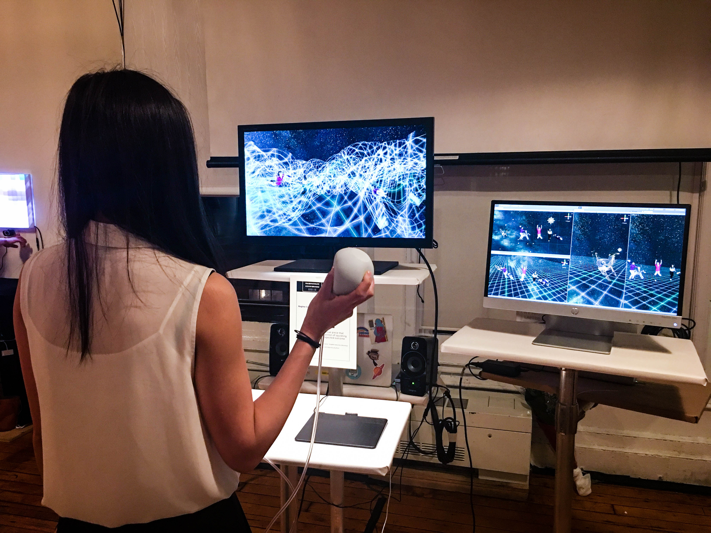

# The Blob
The Blob is an ITP, NYU 2017 project designed and created by Regina Sofia Cantu & Woraya (Mint) Boonyapanachoti.

## Overview
The Blob is a rapid game prototype project created from scratch using ::  
 
* Unity3D game engine to build an environment
* Arduino and Pressure sensor to make a new playful squishy physical controller
* 3D Structure Sensor to quickly 3D scan our avatars into the virtual world
* Adobe Maximo to animate movements
* Max/Msp/Jitter to manipulate a simple sine wave sound that response to the player’s squeezing the ball
 
 

 
 

